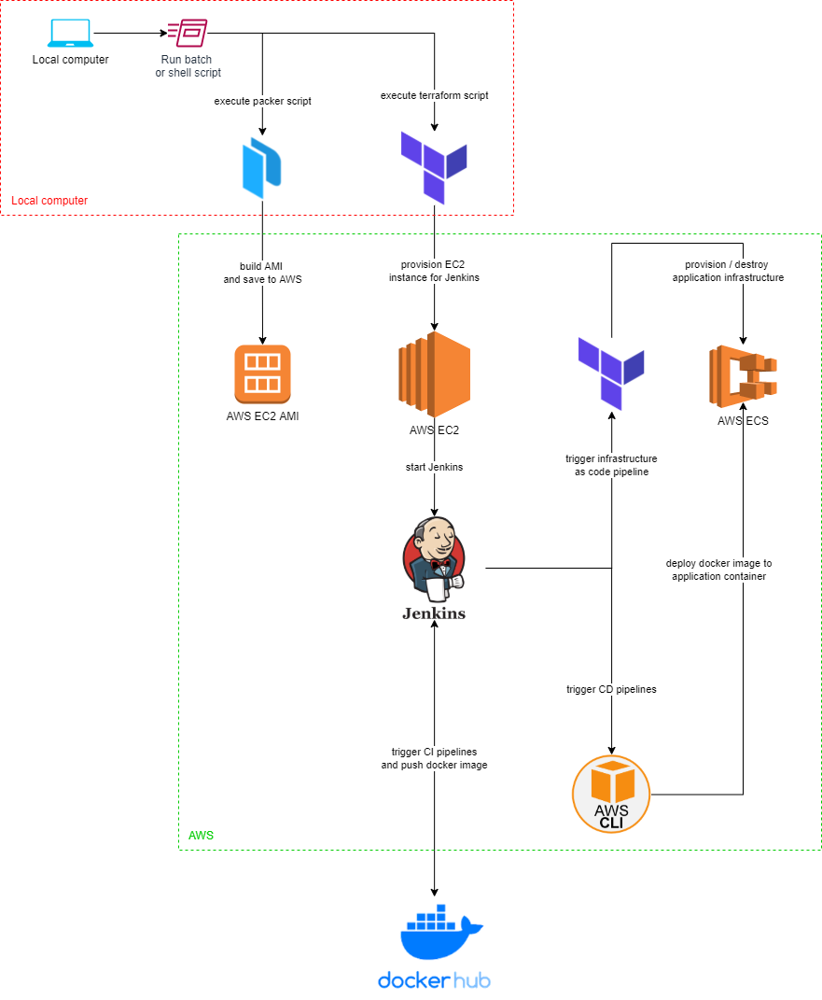
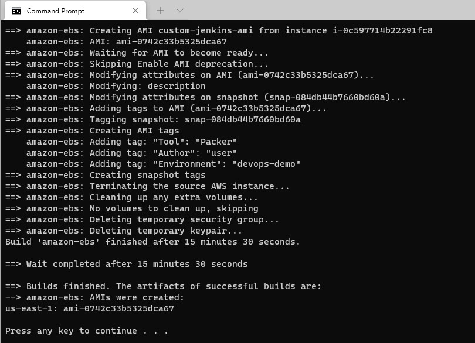
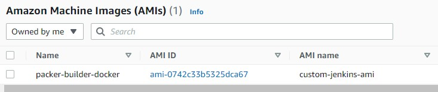
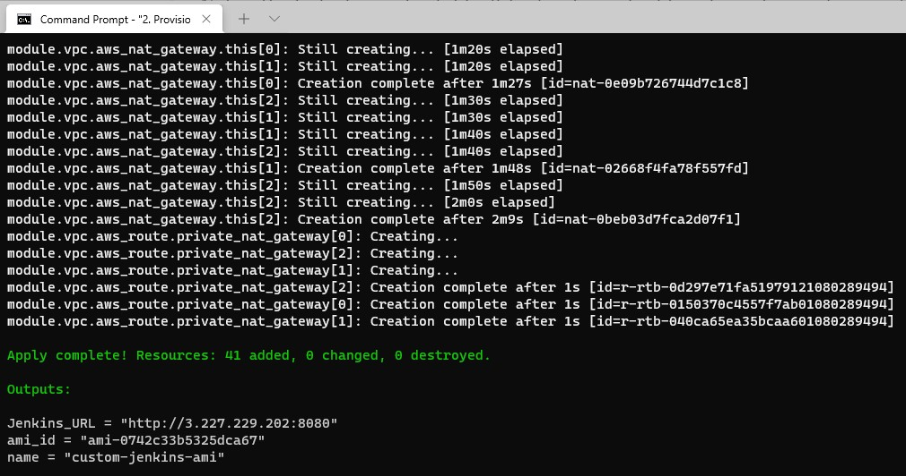
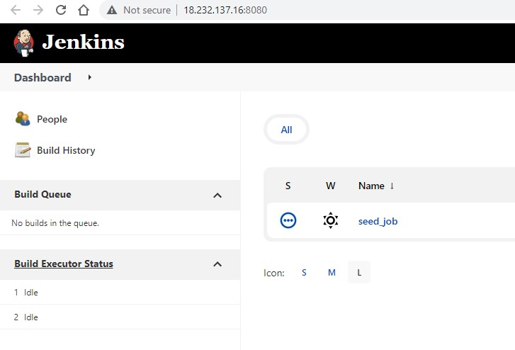
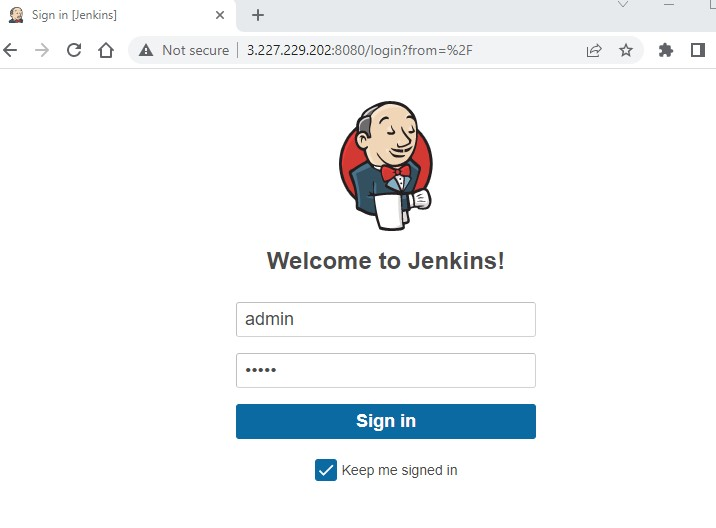
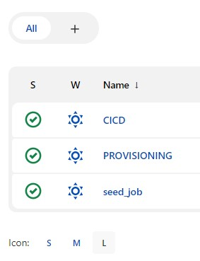
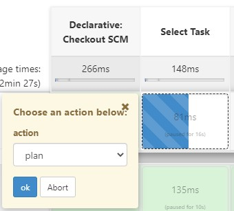
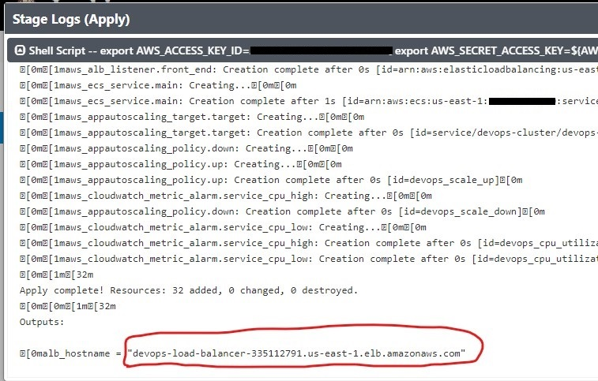
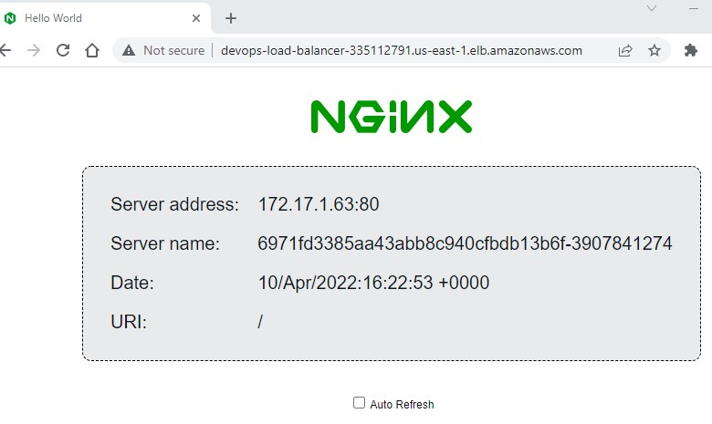

# Cloud IaC DevOps

This project is used to setup AWS infrastructure for a react/springboot application

## ARCHITECTURE

## HOW IT WORKS

- The script uses packer to build an AMI base image in us-east-1 region. The base image has Jenkins installed along with required plugins
- Using the above AMI, the script then uses terraform to provision an AWS EC2 instance for Jenkins
- Using the above Jenkins instance, the script then sets up an initial seed job which sets up 3 pipelines including a IaC pipeline, as well as a frontend and backend CICD pipeline
- Using the above IaC pipeline, the script then uses terraform to provision an AWS ECS load-balanced and monitored infrastructure to run the application
- The above IaC pipeline also contains a clean up pipeline to destroy the application infrastructure provisioned above
- The above CICD pipeline checks out [application code](https://github.com/ibrolive/react-and-spring-data-rest) from an external repository, builds and tests the application, pushes the application docker image to dockerhub and deploys the application to AWS ECS. The application itself is a react/springboot application which connects to a mysql database deployed in aws in place of the h2 in-memory database
- The project takes advantage of AWS cloud native logging and monitoring such as CloudWatch

## ASSUMPTIONS
1. This project and all the setup scripts were developed on a Windows platform. The equivalent shell scripts have also been included and tested in Windows Subsystem for Linux (WSL), however the project is optimized to run on Windows
2. This demo was developed using an AWS user with admin permissions (FullAccess) to EC2 and ECS
3. For this demo, users can be managed through an existing AWS Organization, AWS SSO or through IAM users

## HOW TO USE
1. Install following pre-requisites on your local computer to provision Jenkins on AWS EC2:
   - [packer 1.8.0](https://www.packer.io/downloads)
   - [terraform 1.1.8](https://www.terraform.io/downloads)
   - [aws-cli](https://aws.amazon.com/cli/)

2. Verify that the required versions of the pre-requisites are correctly installed using the following commands:
   - `packer -v`
   - `terraform -v`
   - `aws --version`

3. Open a Command Prompt window and execute `aws configure` to setup the required AWS Access Key ID, AWS Secret Access Key and default region (us-east-1) for the AWS account where the infrastructure will be provisioned. Note that the default region has to be us-east-1 for this demo as the base AMI image used for this demo is located in this region.

4. Checkout the code from this github repository

5. In [0.AMI\node-agent.groovy](https://github.com/ibrolive/cloud-devops/blob/main/0.AMI/node-agent.groovy), update **registryCredentials** with username and password for your docker account, and **awsCredentials** with AWS_ACCESS_KEY_ID and AWS_SECRET_ACCESS_KEY for your AWS account

6. Execute `1.Build-AMI.bat` to provision a base AMI image (with Jenkins already installed) using packer. The AMI build should only take a few minutes. If an error occurs (might happen if you're running the script behind a proxy), log file can be found in 0.AMI\packer.log. Once AMI is built successfully, you should see a message similar to the screenshot below:

You should also see a [new AMI in us-east-1 region](https://us-east-1.console.aws.amazon.com/ec2/v2/home?region=us-east-1#Images:visibility=owned-by-me) like the screenshot below:

If you get this error: 

`The builder amazon-ebs is unknown by Packer, and is likely part of a plugin that
is not installed.`

then run the command below:

`packer plugins install github.com/hashicorp/amazon`

7. In [1. terraform-jenkins-server/jenkins.tfvars](https://github.com/ibrolive/cloud-devops/blob/main/1.%20terraform-jenkins-server/jenkins.tfvars), you can set the values for the following or use the current default values:
   - default region (must be us-east-1 for this demo)
   - preferred jenkins login username (default is 'admin')
   - preferred jenkins login password (default is 'admin')
   - EC2 instance size for jenkins (default is 't2.small')

8. Update `docker_image_repository` on line 1 of [3. ci-cd/CI_CD_Frontend.Jenkinsfile](https://github.com/ibrolive/cloud-devops/blob/main/3.%20ci-cd/CI_CD_Frontend.Jenkinsfile) and [3. ci-cd/CI_CD_Backend.Jenkinsfile](https://github.com/ibrolive/cloud-devops/blob/main/3.%20ci-cd/CI_CD_Backend.Jenkinsfile)

9. Execute `2.Provision-Jenkins.bat` to provision a Jenkins EC2 instance on AWS using Terraform. After the Jenkins instance is successfully provisioned, Jenkins login URL should be displayed. See screnshot below:

10. Copy and paste Jenkins URL in your browser to launch Jenkins. You should see a seed job which adds other jobs to Jenkins. See screenshot below:

11. Click the log in button at the top right corner to login to Jenkins using the Jenkins username and password you provided in the above step:

12. By now, the seed job should have added three more jobs to Jenkins. All four jobs (seed job, provisioning pipeline, frontend pipeline and backend pipeline) should be triggered automatically for the first time. Naturally, the frontend and backend pipelines will fail to deploy until the AWS ECS infrastructure has been provisioned using the provisioning job.

13. The provisioning job is used to create infrastructure for AWS ECS and AWS RDS for mysql. Select the provisioning job, and select the action you would like to perform. You can perform the following actions:
    - plan: this executes a simple terraform plan and shows you all the infrastructure that will be provisioned by terraform
    - apply: this executes a terraform apply which provisions the AWS ECS infrastructure on your account
    - plan-destroy: this executes a simple terraform plan -destroy and shows you all the infrastructure that will be destroyed
    - destroy: this executes a terraform destroy and does a clean up of the application infrastructure provisioned by terraform on this Jenkins server (excluding the Jenkins server itself ofcourse)

14. Go to the PROVISIONING pipeline, click "Build Now", and select the plan action. If the plan fails, verify that you have entered correct AWS credentials in Jenkins credentials. Once the plan is completed successfully, click "Build Now" again and this time select the apply action.

15. Once infrastructure provisioning is completed successfully, you should see the URL for the application in the Jenkins build logs:

You should now see a new cluster in [AWS ECS](https://us-east-1.console.aws.amazon.com/ecs/home?region=us-east-1#/clusters). You should also see a new MySQL database in [AWS RDS](https://us-east-1.console.aws.amazon.com/rds/home?region=us-east-1#databases:).

16. From the Jenkins build logs, copy & paste the application URL (alb-hostname) into your web browser. A simple nginx web app should be displayed, showing you that your infrastructure was provisioned correctly:

17. Go to the CICD-Frontend pipeline and click "Build Now". Repeat the same for the CICD-Backend pipeline. Note that both pipelines will trigger a new build whenever there's a commit in the application git repository.

18. Finally, to clean up the infrastructure, go to the PROVISIONING pipeline on Jenkins, click "Build Now", and select "destroy" action. This should remove all components of the AWS ECS application infrastructure. Next, execute `3.Destroy-Jenkins.bat` batch file. This should destroy the EC2 instance on AWS. Next, execute `4.Destroy-AMI.bat`, this should remove the AMI base image.

