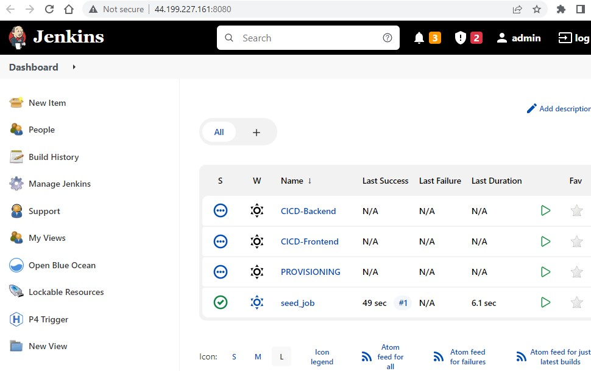

# cloud-devops

## ASSUMPTIONS
1. I have tested the setup scripts for Windows and assume that this demo will be run on a Windows.
2. This demo was developed using an AWS user with admin permissions (FullAccess) to EC2 and ECS.

## HOW TO USE
1. Install following pre-requisites on your local computer to provision Jenkins on AWS EC2:
   - [packer 1.8.0](https://www.packer.io/downloads)
   - [terraform 1.1.8](https://www.terraform.io/downloads)
   - [aws-cli](https://aws.amazon.com/cli/)
2. Verify that the required versions of the pre-requisites are correctly installed using the following commands:
   - `packer -v`
   - `terraform -v`
   - `aws --version`
3. Open a Command Prompt window and execute `aws configure` to setup the required AWS Access Key ID, AWS Secret Access Key and default region (us-east-1) for the AWS account where the infrastructure will be provisioned. Note that the default region has to be us-east-1 for this demo as the base AMI image used for this demo is located in this region.
4. Checkout the code from this github repository
5. In [0.AMI\node-agent.groovy](https://github.com/ibrolive/cloud-devops/blob/main/0.AMI/node-agent.groovy), update registryCredentials username and password for your docker account and your awsCredentials' AWS_ACCESS_KEY_ID and AWS_SECRET_ACCESS_KEY for your AWS account
6. Execute `Build AMI.bat` (for Windows) or `Build AMI.sh` (for Linux) to provision a base AMI image (with Jenkins already installed) using packer. The AMI build should only take a few minutes. If an error occurs (might happen if you're running the script behind a proxy), log file can be found in 0.AMI\packer.log. Once AMI is built successfully, you should see a message similar to the screenshot below:

You should also see a [new AMI in us-east-1 region](https://us-east-1.console.aws.amazon.com/ec2/v2/home?region=us-east-1#Images:visibility=owned-by-me) like the screenshot below:

7. In [1. terraform-jenkins-server/jenkins.tfvars](https://github.com/ibrolive/cloud-devops/blob/main/1.%20terraform-jenkins-server/jenkins.tfvars), you can set the values for the following:
   - default region (must be us-east-1 for this demo)
   - preferred jenkins login username
   - preferred jenkins login password
   - EC2 instance size for jenkins
8. Execute `2. Provision-Jenkins.bat` (for Windows) or `Provision-Jenkins.sh` (for Linux) to provision a Jenkins EC2 instance on AWS using Terraform. After the Jenkins instance is successfully provisioned, Jenkins login URL should be displayed. See screnshot below:

9. Copy and paste Jenkins URL in your browser to launch Jenkins. You should see a seed job which adds other jobs to Jenkins. See screenshot below:

10. Click the log in button at the top right corner to login to Jenkins using the Jenkins username and password you provided in the above step:

11. By now, the seed job should have added three more jobs to Jenkins. All four jobs (seed job, provisioning pipeline, frontend pipeline and backend pipeline) should be triggered automatically for the first time. Naturally, the frontend and backend pipelines will fail to deploy until the AWS ECS infrastructure has been provisioned.

12. The provisioning job is used to create AWS ECS infrastructure. Select the provisioning job, and select the action you would like to perform. You can perform the following actions:
   - plan: this executes a simple terraform plan and shows you all the infrastructure that will be provisioned by terraform
   - apply: this executes a terraform apply which provisions the AWS ECS infrastructure on your account
   - plan-destroy: this executes a simple terraform plan -destroy and shows you all the infrastructure that will be destroyed
   - destroy: this executes a terraform destroy and does a clean up of the application infrastructure provisioned by terraform on this Jenkins server (excluding the Jenkins server itself ofcourse)

13. Select the apply action in the provisioning job above.

14. Update `dockerhub_repository` on line 1 of [3. ci-cd/CI-CD.Jenkinsfile](https://github.com/ibrolive/cloud-devops/blob/main/3.%20ci-cd/CI_CD.Jenkinsfile)

## ARCHITECTURE

### CI/CD PIPELINE

1. build code base

2. test code base

3. build docker container

4. push docker container

5. deploy frontend and backend services to AWS ECS

### INFRASTRUCTURE PROVISIONING (TERRAFORM)

1. create infrastructure as code for:
   - Jenkins build server (for CI/CD) + Nagios server (for monitoring and auditing)
   - pipeline to provision frontend and backend ECs instances on AWS
2. setup access control (to allow multiple personal accounts)

3. add auto scaling to servers (bonus point)

4. mysql/postgresql database (bonus point) [not done]
 
5. create destroy functionality

## CLEAN UP / DESTROY
1. Execute `Destroy-Jenkins.bat` or `Destroy-Jenkins.sh` batch file